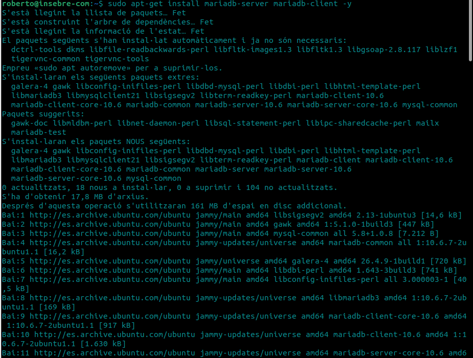
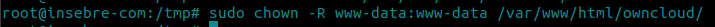

# Instalación de Owncloud en Linux
En aquesta pàgina instal·laràs el servei owncloud al teu propi equip, per això instal·laràs i configuraràs LAMP i Owncloud.

## Instalar Apache
Instal·lem el servidor Apache:

Desactivem el llistat de directoris del servidor:

---------------------------------------------------------------------------------------------------------------------------------------------

## Instal·lem MariaDB

Instal·lem MariaDB:

I configurem la instal·lació:
*Quan fem aquesta comanda haurem de seleccionar aquestes opcions:*

- Deshabilitar usuaris anònims.
- Desactivar accés remot com a root.
- Eliminar les bases de dades de testeig i accedir-hi.
- Actualitzar les taules de privilegis.

Finalment reiniciem el servidor MariaDB:

- sudo systemctl restart mariadb.service` o `sudo service mariadb.service restart

---------------------------------------------------------------------------------------------------------------------------------------------
# Crear la base de dades d'owncloud

Entrem a MariaDB:

Creem la base de dades:

Creem un usuari anomenat ownclouduser amb una contrasenya que podria ser Admin1234:

Us donem accés a l'usuari a la base de dades creada:

Apliquem els canvis i sortim:

---------------------------------------------------------------------------------------------------------------------------------------------

# Instal·lar PHP i els seus mòduls necessaris

Actualitzem els paquets amb el repositori afegit:

Instal·lem PHP i els mòduls necessaris:
*Hem de tenir en compte els requisits d'Owncloud abans d'instal·lar els mòduls.*

Després de la instal·lació editem el fitxer php.ini i canviarem alguns valors:

*Els valors que hem de canviar són els següents:*

- file_uploads = On 
- allow_url_fopen = On 
- memory_limit = 256M 
- upload_max_filesize = 100M 
- display_errors = Off 
- date.timezone = Europe/Madrid

---------------------------------------------------------------------------------------------------------------------------------------------

# Instal·lem Owncloud

Descarreguem la darrera versió del programa i descomprimim els fitxers, a més movem els fitxers d'Owncloud a "/var/www/html/owncloud":

Canviem propietari i permisos dels directoris d'owncloud. www-data perquè els pugui fer servir Apache, 755 perquè els pugui executar i llegir qualsevol usuari de Linux:

---------------------------------------------------------------------------------------------------------------------------------------------

# Configura Apache

Configurarem Apache:

Hem de deixar un fitxer com el següent, però canviant el ServerName i el ServerAlias pels noms i àlies del nostre propi domini.

.png)

**El significat de cada línia:**

- `ServerAdmin admin@example.com`--> El nom del administrador del servidor
- `DocumentRoot /var/www/html/owncloud`--> És una de les directives d'Apache que ens permeten configurar-ne el funcionament, i tal com les altres, es pot canviar d'acord amb les nostres necessitats
- `ServerName owncloud.pri.com`--> El nom del servidor
- `ServerAlias www.owncloudpri.com`--> Directori on es guarden els fitxers servidor en aquest virtual host
- `Alias /owncloud "/var/www/html/owncloud/"`--> Un sobrenom 
- `<Directory /var/www/html/owncloud>"`--> El directori on esta situat
- `Options FollowSymlinks`--> És una directiva dels servidors web Apache, que serveix per seguir els enllaços simbòlics d'un directori
- `AllowOverride All`--> Controla quines directives es poden situar als fitxers .htaccess.
- `Require all granted`--> Permisos para que tingue accés a tot
- `<IfModule mod_dav.c>`--> Per accedir al meu lloc web allotjat
- `Dav off`--> Modo silenci apagat
- `</IfModule>`--> Tancament de línia
- `SetEnv HOME /var/www/html/owncloud`--> Per posar la ruta principal de la nostra pàgina web
- `SetEnv HTTP_HOME /var/www/html/owncloud`-->
- `</Directory>`--> Tancametn de línia del directori

Habilitem owncloud i el mòdul rewrite:

Reiniciem Apache:

`sudo service Apache2 restart`

**A partir d'aquest moment podem accedir a owncloud des del navegador per això hem d'introduir la nostra IP seguida de "/owncloud" al mateix, per exemple si la nostra IP és 172.31.84.197 posarem al navegador 172.31.84.197/owncloud i podrem accedir al servei.**

**Ja al navegador creem un compte d'administració i posem les dades de MariaDB que hem configurat anteriorment.**

En el meu cas per verure quina es la meva IP he intrduït `ip a` i he trobat la meva IP.

Ara ja podem entra a Owncloud, entrem al nostre navegador i posem la nostra IP seguidament amb /owncloud i haurem de posar les dades que hem introduït a MARIADS

I finalment una vegada posem les dades haurem de obtindre aixó:

---------------------------------------------------------------------------------------------------------------------------------------------

# Explicacions comandes

- Què fa la comanda a2ensite? **A2ensite és un script que habilita un lloc web especificat**

- I la comando a2dissite? **A2dissite és un script que deshabilitar un lloc web especificat**

- Què significa la línia de `/etc/hosts` --> **La línia `/etc/hosts` significa la ruta del arxiu on pots configurar els enllaços que busques al buscador per portarte a unaltre lloc**

